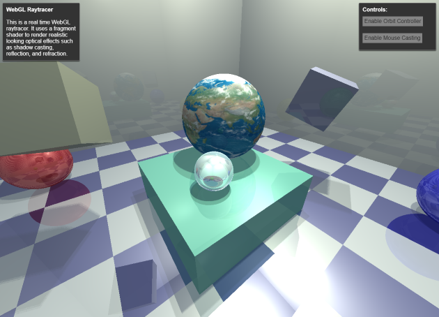

# WebGL Raytracer
Author: Dylan Cutler

---

This project is an interactive WebGL raytracer written
in TypeScript and modular GLSL compiled to a single
bundle program (`public/bundle.js`) with Webpack.

[Live Demo*](http://dcthetall-webgl-raytracer.herokuapp.com)

*I got this to work on my laptop which uses an Intel Iris Graphics 6100 (not great) and it renders at 10 fps reasonably. I do not recommend trying to open it on mobile or a netbook.

---

Features include:
- Can render multiple spheres and rectangular prisms
- Rectangular prisms can have arbitrary rotation
- Blinn-Phong illumination on surfaces
- Shadow casting
- Reflective surfaces
- Sphere materials refract light using matrix ray
  tracing
- Parametric texture mapping on spheres
- Orbit controls
- A mouse caster which highlights shapes when you
  hover over them
- Ability to toggle UI features
